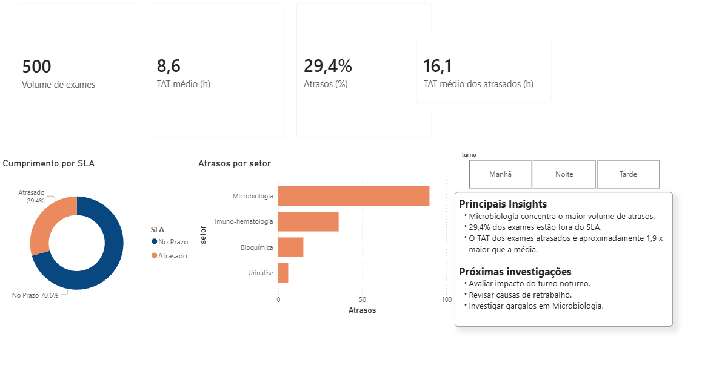

# Laboratory SLA Dashboard, Power BI

## Dashboard Preview

## Overview
Dashboard desenvolvido em Power BI para monitoramento de indicadores operacionais em laboratório clínico.

## Business Question
Como identificar fatores que impactam o cumprimento de SLA em exames laboratoriais?

Este dashboard busca investigar:

- Quais setores concentram maior volume de atrasos
- Se o turno influencia o desempenho operacional
- Se exames atrasados apresentam aumento relevante no TAT
- Quais gargalos merecem investigação adicional

## Indicadores Monitorados

- Volume de exames
- TAT médio (Turnaround Time)
- Percentual de exames atrasados
- TAT médio dos exames atrasados
- Distribuição de atrasos por setor
- Análise por turno (Manhã, Tarde, Noite)

## Principais Insights

- 29,4% dos exames ficaram fora do SLA.
- Microbiologia concentrou maior volume de atrasos.
- TAT dos exames atrasados foi quase 2x superior ao TAT médio.
- Turno noturno apresentou pior desempenho operacional.

## Hypothesis Test

### Hypothesis
O turno noturno pode apresentar maior risco operacional e contribuir para aumento de atrasos.

### Approach
Utilizei o filtro por turno no dashboard para comparar:

- Percentual de exames atrasados
- TAT médio por turno
- TAT médio dos exames atrasados
- Distribuição de atrasos por setor

### Preliminary Finding

A análise sugere evidência preliminar de maior severidade dos atrasos no turno noturno, apesar de menor TAT médio geral.

Isso indica que, embora parte dos exames noturnos apresente menor TAT médio, os casos que entram em atraso tendem a apresentar maior impacto operacional.

## Ferramentas Utilizadas

- Power BI
- Excel
- DAX
- Data Visualization

## Arquivos do Repositório

- dashboard_powerbi.pbix , dashboard interativo
- dataset_excel.xlsx , base simulada utilizada
- dashboard_preview.png , visão do painel

## Próximas Investigações

- Avaliar causas de atraso em Microbiologia
- Investigar impacto do retrabalho
- Comparar performance entre turnos

## Observação

Este projeto utiliza dados fictícios criados para fins de portfólio e demonstração analítica.
